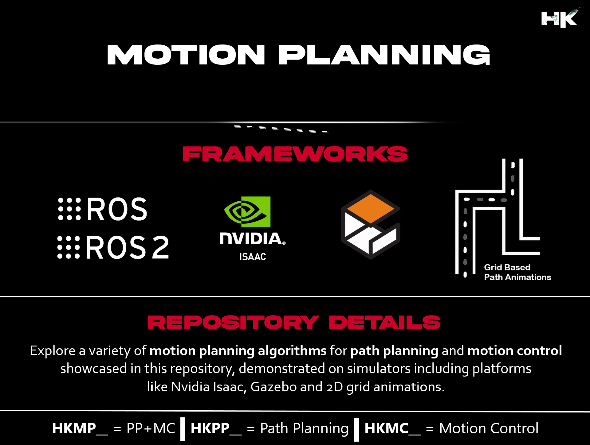
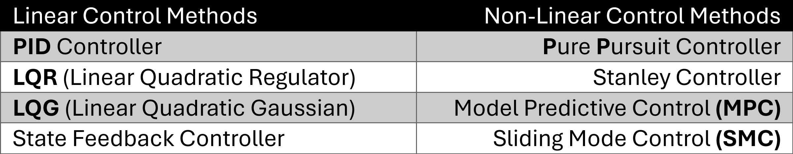

    

 
           

    

    

<h1 align="left">⭐ Motion Control Algorithms</h1>

    

<h1 align="left">🔻 What is Motion Planning Pipeline?</h1>

    Motion planning is a key concept in autonomous systems, enabling robots and autonomous vehicles to determine how to achieve a desired state or task in an environment filled with obstacles. It encompasses the stages of path planning and motion control algorithms. Together, these components form the motion planning pipeline, which is critical for the autonomy of robotic systems.

<h1 align="left">🔻 What are Path Planning Algorithms?</h1>

    ▸ Path planning is the process of determining a path from a starting point to a destination that avoids obstacles and is optimal based on certain criteria, such as the shortest distance, minimum time, or least energy consumption.
      
    ▸ In robotics and autonomous vehicle navigation, path planning is crucial for navigating through an environment efficiently and safely. It involves analyzing the environment, often represented as a graph or a grid, and applying algorithms to find the best route considering the system's limitations and the physical properties of the environment.

<h1 align="left">🔻 What are Motion Control Algorithms?</h1>

    ▸ Motion control algorithms are the set of computational techniques that direct the movement of robots or autonomous vehicles to follow a given path or reach a specified location. These algorithms consider the system's dynamics, including its acceleration, velocity, and the forces acting upon it, to execute movements accurately and efficiently.
      
    ▸ They ensure that the system adheres to the planned path while adjusting for real-time obstacles and changes in the environment. Motion control is fundamental in robotics, ensuring precise and adaptive movements for tasks ranging from simple navigation to complex manipulations.

                                        

  

    

